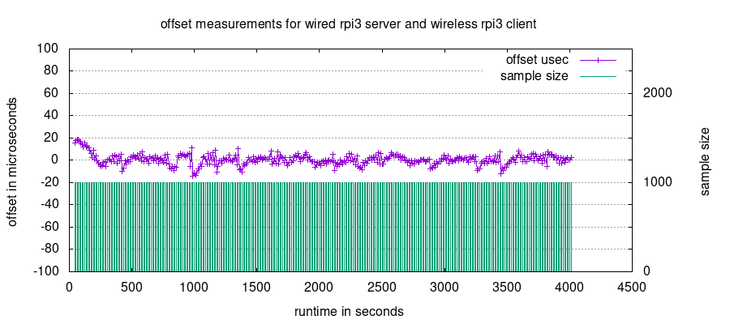

# twitse

## What is this
This is an experimental playground for getting a wireless raspberry pi client and a wired raspberry pi server in 'pretty good' time sync. 

The following graph shows an hour of measurements on a plain 2.4GHz wifi. It is an ideal sunshine recording (given it seem to work) with unthrottled measurements. It can be interpreted in as many ways as one wants to do it, but the bottom line is that it give a graphical view of the standard deviation and response time between aggregated measurements. Given the awfull latencies of a wireless connection it doesn't look too bad.

There are some more words [here](doc/TLDR.md).

