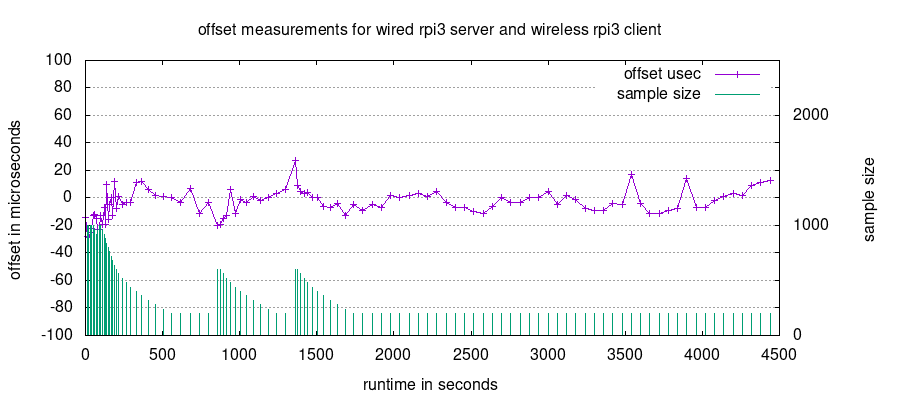
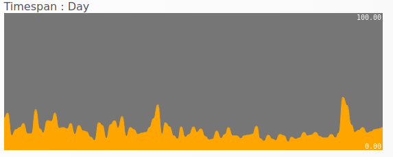

# Twitse

## The wireless time sync experiment
This project is an experimental playground for getting multiple wireless raspberry pi clients and a wired raspberry pi server running with 'pretty good' time synchronization between server and clients. The measured time offsets generally lie in the sub-50 microsecond domain which is not too bad given that there is wifi connections in the mix.

The reason behind this project was to develop a diy timing framework for playing lossless audio on multiple wireless raspberry pi clients, where e.g. two clients could be playing either right or left channel of a stereo signal, controlling an active speaker each. The accuracy actually required for such an audio setup is not part of the project here, for now its just about getting a feel for the obtainable timing accuracy in a minimal wireless setup.

The Twitse project is both a hardware and a software project. The software is available here, the hardware design not so much, at least not yet. Both server and clients boards have their standard 19.2MHz X1 raspberry pi crystals replaced with DAC controlled VCTCXO oscillators. This way the software are able to adjust the coreclock on the clients meaning that the clients are kept in time sync down to and including the physical Raspberry Pi hardware. The server is using the VCTCXO to let the wallclock track NTP time.

Since this is probably a little too steep for most, Twitse can also run in a pure software mode for playing around. In software mode the clients and server are in time sync in the software alone which is used by the clients to periodically adjust their wallclock.

The following graph shows little over an hour of measurements on a plain 2.4GHz wifi for a single client. The purple graph is the measured time offsets, and the green lines indicate how often a measurement is made and the number of UDP packets used at each measurement. Given the awful latencies of a wireless connection it doesn't look too bad to have a graph in the microsecond domain. Its worth pointing out that this is the measured time offsets which will consist of the real offsets plus measurement noise. Since there is definitely measurement noise its probably safe to assume that the real offsets are lower than the graph suggests. The steady state finally reached with regard to network load currently uses 200 samples once every minute to keep the offsets under wraps.

The next plot spans 24 hours and tries to show the single most important metric for the project which is how closely multiple clients are kept in time sync. It is based on a two client setup. Each time a measurement is made, it is compared to the last measurement for the other client and the single largest delta seen is kept. This runs in 15 minute intervals, so the single largest observed time offset deviation between the two clients in a 15 minute window is plotted (in microseconds) for each 15 min. The only conclusion that can be drawn from the graph is that this kind of performance appears to be obtainable with a well-behaving network, what it does not show is how awful it could be on a non-well-behaving network.

The normal solution to quality time measurements would be adding an RTC but this wont cut it here since even though it exhibit super low drift it will eventually get out of sync. There are obviously NTP/PTP implementations elsewhere, satellite receivers and other means of keeping track of time drift and they could probably all replace the part of Twitse that does the same. Its the part with the voltage controlled oscillator driving the Raspberry Pi clients that is a bit unusual. Anyway, it seemed like a fun project to play with so here it is, [nih](https://en.wikipedia.org/wiki/Not_invented_here#In_computing) or not.

A note about accuracy and quality: there is not necessarily anything impressive about insanely precise time measurements, they will inevitably come as soon as an insane number of measurements are made. The quality of a framework will be evaluating the effort (network load) to gain a wanted precision. And the implementation here does _not_ claim to be an especially nice and well-behaved citizen on a (W)LAN. Another framework quality measure will be how gracefully it copes with a bad network, and lets just say that Twitse doesn't really like that. So the requirement for this project to pull off is that it has unhindered access to the airwaves, whatever that means. This is not a showstopper for e.g. a audio system where a separate network probably make pretty good sense in the first place.

## More words

[Twitse software only mode on unmodified raspberry pi](doc/software.md) 

and 

[Twitse for hardware modified raspberry pi and VCTCXO carrier board](doc/VCTCXO.md).

   

## Assorted links
PTPD on wireless raspberry pi 2. 50us precision back then so it might be even better now. This project was made before (!) spotting that discussion:
https://sourceforge.net/p/ptpd/discussion/469208/thread/74b512c5/

Frequency stability on raspberry 2 with some nice plots:
https://2n3904blog.com/raspberry-pi-2-frequency-stability/

Hackaday: GPS Disciplined xCXO. A nice writeup about voltage controlled oscillators and DACs.
https://hackaday.io/project/6872-gps-disciplined-xcxo

Hackaday: Replacing the RPI crystal with a GPS clock
https://hackaday.com/2019/06/26/accurate-time-on-your-pi-the-extreme-way/

Talk about replacing the raspberry pi X1 crystal as done here in VCTCXO mode.
https://raspberrypi.stackexchange.com/questions/74482/switch-out-the-x1-oscillator-on-a-rpi-2-3

Terradak TCXO RPI HAT: A audio player HAT with two TCXO oscillators intended to replace both the 19.2 and 25.0 MHz crystals on a RPI 3B+. The page has some pictures of the RPI showing the pads the xtal feeds should go to.
https://www.teradak.com/products/115.html

PTP IEEE-1588 implementation that runs on the raspberry pi using time-stamping in software.
https://github.com/twteamware/raspberrypi-ptp>

Switch out the X1 Oscillator on a RPI 2/3. Cool measurements on stock crystal vs. a TCXO replacement.
https://raspberrypi.stackexchange.com/questions/74482/switch-out-the-x1-oscillator-on-a-rpi-2-3

"Sync up your clocks! Better PTP settings on Raspberry Pi". More on software PTP on a RPI with a lot of measurement graphs. Still only wired tests though. Mentions a kernel switch called "nohz=off" which calls for an experiment someday.
https://vejipe.medium.com/sync-your-clocks-better-ptp-settings-on-raspberry-pi-37a9a54e4802

PPS-Client, microsecond precision with a GPS (pulse-per-second) module on raspberry pi.

https://github.com/rascol/PPS-Client

The Raspberry Pi CM4 NIC (BCM54210PE) has PTP support. https://www.jeffgeerling.com/blog/2022/ptp-and-ieee-1588-hardware-timestamping-on-raspberry-pi-cm4

Switch out the X1 Oscillator on a RPI 2/3 (for better stability) (pictures and TCXO/OCXO)

https://raspberrypi.stackexchange.com/questions/74482/switch-out-the-x1-oscillator-on-a-rpi-2-3

Clocks and PLLs on rasberry pi from https://elinux.org/The_Undocumented_Pi#Clocks

