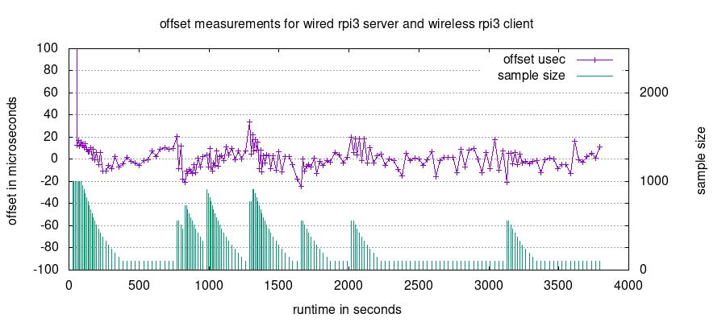

# wifitimesync

## TLDR
The reason behind this project was to develop a timing framework for playing audio on multiple wireless raspberry pi clients, where e.g. two clients could be playing either right or left channel of a stereo signal. The accuracy actually required for such an audio setup is not part of the project here, for now its just about getting a feel for the obtainable timing accuracy in a minimal wireless setup.
The normal solution to quality time measurements would be adding an RTC but this wont cut it here since even though it exhibit super low drift it will eventually get out of sync. There are obviously NTP/PTP implementations elsewhere but it seemed like a fun project to play with so here it is. Also note that the quest actually is to get multiple clients in sync between each other, not so much their deviation from e.g. absolute server time. 

A note about accuracy and quality: there is not nescesarily anything impressive about insanely precise time measurements, they will inevitably come as soon as an insane number of measurements are made. The quality of a framework will be evaluating the effort (network load) to gain a wanted precision. And the implementation here does _not_ claim to be a nice wellbehaved citizen on a (W)LAN. Another framework quality measure will be how gracefully it copes with a bad network, and for the project here this very easy to describe, it is awfull, bordering disfunctional, when competing with a couple of streaming teenagers. So the requirement for this project to pull off is that it has unrestricted access to the airwaves. This is not a showstopper for e.g. a audio system where a seperate network probably make pretty good sense in the first place.

Here is another plot, this time trading accuracy for much less traffic. The number of samples are now between 100 and 1000 and the measurement period increases up to 30 secs. As can be seen then the throttling algorithm is triggered by measurements more than 20 us off.

The operation is that the server time is the reference. The client continuesly adjusts its measured crystal drift relative to the server so the client software can maintain an illusion about what the true server time is at all times. Since the raspberry pi crystals are relatively poor this drift can easily be up to 10 ppm. Another side effect of the poor crystals is that their temperature stability is all over the place. In order to make a graph as above both raspberry pi need to be in a very temperature stable environment. So right now multiple clients are brought in some kind of sync by letting them all follow the server time.

## Some of the caveats
For one the graph above cant be made while NTP is running on the server. So this was turned off. This is not a very usefull solution as the server itself will then drift away from the real wall clock. If this happens at a rate of 10 ppm this can rather quickly become an issue. There is no solution to this yet in the current software.

The time reference in the client exists only inside the client application itself. The client continuesly adjusts its kernel system time but the system time precision will by definition be worse than the precision of the internal time. Also keep in mind that the actual physical crystal will clock all the hardware completely ignorant of all this kernel/user space time adjusting. So e.g. the serial busses will be as far off in timing as always.

Both server and client are so far not doing anything else than measuring time. Once they actually are asked to do something usefull the increased load can be expected to have an impact on the time measurements. Its not known yet what that might amount to.

There are no documentation, only the source code. And its probably not funny to try to decipher. The client/server design is a moving target and the split between tasks done by a client vs the server renders intuition useless.

The solution here uses plain UDP for time measurements. This means that the network traffic will increase linearily with the number of clients which is not a good thing. Initial experiments with multicast only demonstrated how bad this was compared to UDP but another day might bring new multicast experiments.

It takes a lot of time to get comfortable playing with timing software like this since it is so inhumanly slow to test or verify anything. Only the extremely patient should ever try to play with timing software development.

The entire solution here is purely user space. There exists methods to get packet timestamping done by the network layer right before packets are sent to the PHY. This would improve the precision wastly but the raspberry pi unfortunately doesnt appear to support it.

All time testing has been on raspberry pi, with development and functional testing on x86. The point is that the software is not currently optimized to run on x86 with regard to time synchronisation.

The entire system consisting of server and client means running root processes without anything that even remotely resembles any kind of security. At all.

## Building & deploying

After the git clone add spdlog in-tree as a git submodule:

    mkdir external && cd external
    git submodule add https://github.com/gabime/spdlog.git
    git submodule update --init

Otherwise its a standard cmake project. Make an out-of-source build

    mkdir build && cd build
    cmake .. -DCMAKE_BUILD_TYPE=release
    make (client|server)
Experiment with a -j# switch. (4 concurrent compilations might be too much)

A full build produces 4 binaries, server, client, control and dataanalysis.

**server** : the server running on a wired pi. It can be started as is. Both server, client and control uses a common multicast socket so e.g. clients will automatically connect to a running server.
**client** : the client running on a wireless pi. It requires a --id switch with a unique name.
**control** : can reconfigure or query a running server or client via the common multicast socket.
**dataanalysis** : can be used to process raw sample dump files in order to play with the filtering algorithms on canned data. Always a little dated and broken.

Both server and client raspberry pi needs to get overclocked and run continuesly at full tilt. See RPI.md in doc. Just for the record then the server currently run Arch64 and the client Arch32 for no particular reason.

Then its just left to start the server and the client. They should run as root as they run with realtime scheduling, and the client additionally needs root priviledges to adjust its system clock.

## generating a plot

The server generates a raw_'clientname'_client_summary.data file if its told to do so with the command

    control --clientsummaries
If located in ./doc/gnuplot the demo plot can be made with gnuplot with the following command

    gnuplot -c offset_and_sample_size.gp ../../dataanalysis/data/1hourplot/server/raw_test_client_summary.data

    
