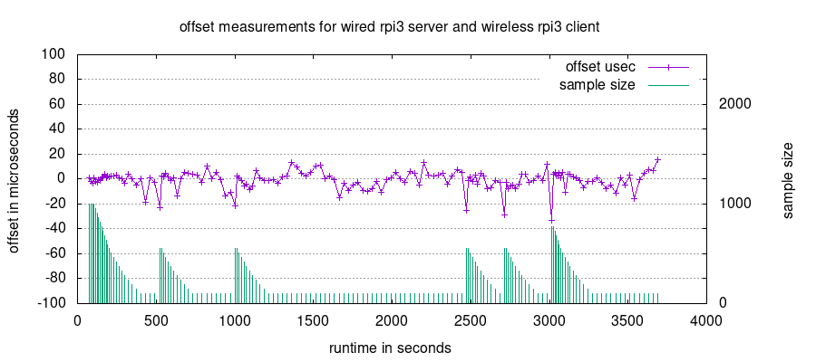

# twitse - VCTCXO mode
Where the default twitse build gives a pure software implementation working on standalone and unmodified raspberry pi boards a VCTCXO build is pretty much the opposite. 

Here the rpi client is supposed to be mounted on a carrier board with among other things a DAC controlling a VCTCXO oscillator. The processor crystal on the client rpi is removed and the pi is now running off the VCTCXO oscillator. Instead of maintaining a software ppm correction as in the standalone mode the client can now control its own 19.2MHz base clock directly. E.g. audio dacs hanging on a i2s serial will now be running at the correct speed continuesly and there is no need for clockpulse/sample skip or resampling to keep multiple clients in sync from normal xtal clock drift.

The carrier board is called LUHAB and in semi populated form it currently look like this:

The DAC and VCTCXO are mounted on the other side of the carrier but the xtal feed to the rpi can be seen. The LUHAB carrier board is intended to be the brain in an active speaker so apart from the DAC/VCTCXO stuff it features e.g. an audio DAC and speaker relays.

And again a plot of about 1 hour of measurements. This time the rpi acting as server was replaced, the first one were so far off that the client VCTCXO couldn't track it. The nominal range for the used VCTCXO is only +/- 8 ppm which is on the narrow side in this game. When running in standalone mode this is not an issue, the software in standalone mode can track anything. The plot looks fine despite beeing a daytime plot while a teenager was watching netflix over wireless as well. The outlier spikes might call for a check of stability of the vctcxo control voltage.

The schematic is available as a pdf in ./docs ([here](images/luhab_schematic.pdf)). The kicad project itself is not online, at least not yet, its a minefield of library files that needs to get sorted out.

## Trivia

When running in VCTCXO mode all timing is based on the unmodifiable CLOCK_MONOTONIC_RAW that ticks everything. So the server is running a NTP deamon in the above example which will maintain the server wall clock without any direct effect on the timing measurements. A compensation for the drift between the ntp wall clock and the base clock still remains to be implemented.

## Building & Running

For building see elsewhere. When launcing add "--vctcxo" when starting server and client.
    

    
