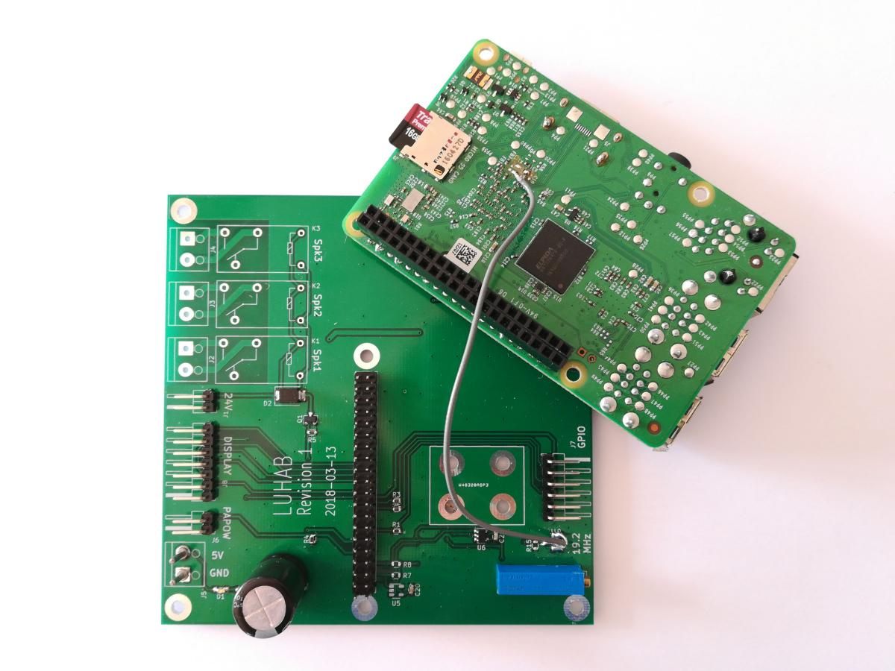

[start page](../README.md)

# Twitse - VCTCXO mode
Where the default Twitse build gives a pure software implementation [here](doc/software.md) working on standalone and unmodified raspberry pi boards a VCTCXO build is pretty much the opposite. 

Here the rpi client is supposed to be mounted on a carrier board with among other things a DAC controlling a VCTCXO oscillator. The 19.2 MHz processor crystal X1 on the client rpi is removed and the pi is instead running off the VCTCXO oscillator. Rather than maintaining a software ppm correction as in the standalone mode the client can now control its own 19.2MHz base clock directly. E.g. audio dacs hanging on a i2s serial will now be running at the correct speed continuously and there is no need for clockpulse/sample skip or resampling to keep multiple clients in sync from normal xtal clock drift.

The carrier board is called LUHAB and in semi populated form it currently look like this:

The DAC and VCTCXO are mounted on the other side of the carrier but the xtal feed to the rpi can be seen. The LUHAB carrier board is intended to be the brain in an active speaker so apart from the DAC/VCTCXO stuff it features e.g. an audio DAC and speaker relays.

The schematic is available as a pdf in ./docs ([here](images/luhab_schematic.pdf)). The kicad project itself is not online, at least not yet, its a minefield of library files that needs to get sorted out.

## Trivia

When running in VCTCXO mode all timing is based on the unmodifiable CLOCK_MONOTONIC_RAW that ticks everything. So the server is running a NTP daemon in the above example which will maintain the server wall clock without any direct effect on the timing measurements. 
The server as of now includes a software ppm correction of the raw clock in an attempt to let the overall Twitse time track the the NTP wall clock. The correction tries to keep the clock difference between the raw clock and the NTP wall clock from going towards infinity without at the same time having any noticeable effect on the offset measurements.

There is a minimal audio player project made for raspberry pi's in VCTCXO mode called [Ludit](https://github.com/bjerrep/ludit). It will play stereo on two separate speakers connected to the world only through a wifi connection.

The VCTCXO used can nominally be adjusted +/- 8 ppm. If the server itself is much too slow or much too fast this will effect the clients ability to get a lock. The first server tried had to be replaced since it was so far off that the clients couldn't track it at all.

## Building & Running

For building see elsewhere except when invoking cmake which is now:

    cmake .. -DCMAKE_BUILD_TYPE=release -DVCTCXO=on

    

    
