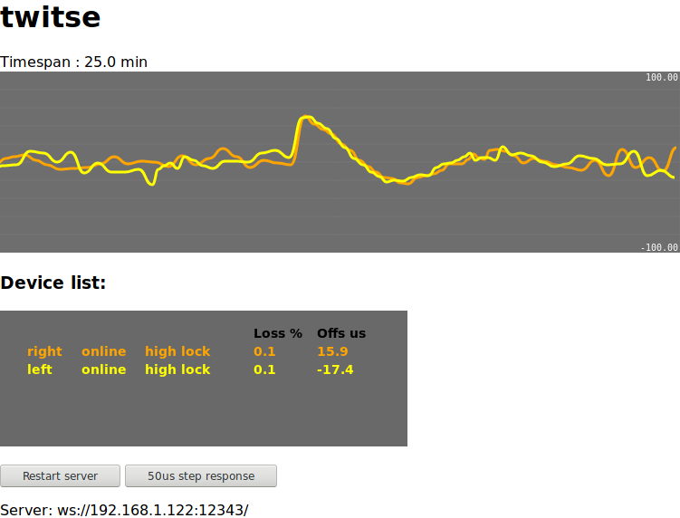

[start page](../README.md)

# Twitse - Software mode

The operation is that the server time is the reference. The client continuesly adjusts its measured crystal drift relative to the server so the client software can maintain an illusion about what the true server time is at all times. Since the raspberry pi crystals are relatively poor this drift can easily be up to 10 ppm. Another side effect of the poor crystals is that their temperature stability is all over the place. Ideally all Raspberry Pi need to be in a temperature stable environment. So what happens is that multiple clients are brought in some kind of sync by letting them all follow the same server time. The clients do not interact at all.

## Some of the caveats
In software mode NTP currently can't be running on the server. So NTP needs to be turned off. This is not a very useful solution as the server itself will then drift away from the real wall clock. If this happens at a rate of 10 ppm this can rather quickly become an issue. There is no solution to this yet in software mode.

The time reference in the client exists only inside the client application itself. The client continuously adjusts its kernel system time but the system time precision will by definition be worse than the precision of the internal time. Also keep in mind that the actual physical crystal will clock all the hardware completely ignorant of all this kernel/user space time adjusting. So e.g. the serial busses in software mode will be as far off in timing as always. 

Both server and client are so far not doing anything else than measuring time. Once they actually are asked to do something useful the increased load can be expected to have an impact on the time measurements. Its not known yet what that might amount to.

It appears that time measurements are influenced whenever the wifi connection decides to dynamically change bitrate. All measurement graphs and values on these pages are from raspberry pi's onboard wifi which luckily seems rather reluctant to change bitrate. Comparing rpi onboard wifi bitrates with those from a Ralink RT5572 adaptor in 10 second intervals:

    RPI onboard     65   65   65   65   65    65   65    65   65   65   65   65   65
    RT5572          78   78   78   104  104  19.5  104   104  78   78   104  104  78

(while sleep 10; do iwconfig wlan0 | sed -n 's/Bit Rate=\(.*\)/\1/p' | awk '{print $1}'; done)
Using an adaptor as the Ralink is perfectly possible, it will just be a little more noisy compared to e.g. the onboard RPI wifi. It should be possible to force a wifi connection to run with a fixed bitrate but so far that has been an exercise in futility. Talking about time measurement quality then don't forget to turn off wifi power save or the time measurements might end up on a different planet.

There are no documentation, only the source code. And its probably not funny to try to decipher. The client/server design is a moving target and the split between tasks done by a client vs the server renders intuition useless.

The solution here uses plain UDP for time measurements. This means that the network traffic will increase linearly with the number of clients which is not a good thing. Initial experiments with multicast only demonstrated how bad this was compared to UDP but another day might bring new multicast experiments.

It takes a lot of time to get comfortable playing with timing software like this since it is so inhumanly slow to test or verify anything. Only the extremely patient should ever try to play with timing software development.

The entire solution here is purely user space. There exists methods to get packet timestamping done by the network layer right before packets are sent to the PHY. This would improve the precision vastly but the raspberry pi unfortunately doesn't appear to support it.

All time testing has been on raspberry pi, with development and functional testing on x86. The point is that the software is not currently optimized to run on x86 with regard to time synchronization. Notice that if both server and client are running on the same computer then the time tracking will be very poor (although it shouldn't get unstable and make things fall over).

The entire system consisting of server and client means running root processes without anything that even remotely resembles any kind of security. At all.

There are two different builds, standard build (this page) and VCTCXO build. Both should build without problems but it might happen that either build actually doesn't quite work as expected if focus have been too much on the other...

## Building & deploying

After the git clone add spdlog in-tree as a git submodule:

    mkdir external && cd external
    git submodule add -f https://github.com/gabime/spdlog.git
    git submodule update --init

Otherwise its a standard cmake project. Dependencies are qt5-base and  probably i2c-dev. Make an out-of-source build. The following will make a software operation build:

    mkdir build && cd build
    cmake .. -DCMAKE_BUILD_TYPE=release
    make (twitse_client|twitse_server)

Experiment with a -j# switch if building on a rpi. (4 concurrent compilations might be too much)

A full build produces 4 binaries, server, client, control and dataanalysis.

**twitse_server** : the server running on a wired pi. It can be started as is. Both server, client and control uses a common multicast socket so e.g. clients will automatically connect to a running server. The wireless interface should be off on the server.

**twitse_client** : the client running on a wireless pi. It requires a --id switch with a unique name.

**control** : can reconfigure or query a running server or client via the common multicast socket.

**dataanalysis** : can be used to process raw sample dump files in order to play with the filtering algorithms on canned data. Always a little dated and broken.

Both server and client raspberry pi needs to get overclocked and run continuously at full tilt. See RPI.md in doc. Just for the record then the server currently run Arch64 and the client Arch32 for no particular reason.

Then its just left to start the server and the client. They should run as root as they run with realtime scheduling, and the client additionally needs root privileges to adjust its system clock.

### systemd 

There are template service scripts for server and client in ./systemd. Edit to get the paths straight and then make a symlink to them from /etc/systemd/system:

    ln -s <twitse path>/systemd/twitse_<client|server>.service /etc/systemd/system

Remember to run 'systemctl enable <service>' if twitse should run at boot.

To run a tail on the stdout log messages sent from e.g. the server when running as a service use 

    journalctl -f | grep "server\["

## generating a plot

The server generates a raw_'clientname'_client_summary.data file if its told to do so with the command

    control --clientsummaries
If located in ./doc/gnuplot the demo plot can be made with gnuplot with the following command

    gnuplot -c offset_and_sample_size.gp ../../dataanalysis/data/1hourplot/server/raw_test_client_summary.data

## webmonitor

A client side only webpage that connects to the server via a websocket and plots a nice graph over the current offsets. Once clients and server are running silently as services on raspberry pi computers this is page is one way to quickly figure out how the little buggers are behaving. Make sure that only the wired interface is up on the server, otherwise traffic might get routed through both wired and wireless and then nothing works.

The plot shows the transient offset tracking after pressing the '50us step response' button. This adds a 50 microsecond offset to the internal time and as can be seen then there is some work left to get rid of the under-damped response.

Launch

    index.html

in doc/webmonitor in a browser. Edit it to give it the correct server ip address if needed, it will default scan the 192.168.1.* class C network.

There is a systemd script 'twitse_webmonitor' in ./systemd intended to be running on the server that will launch a python 3 web server on port 8000.

